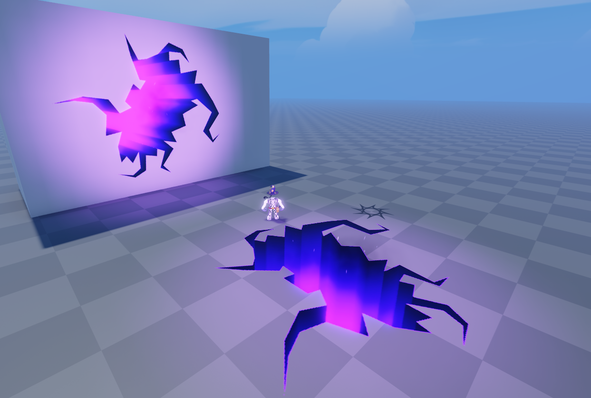
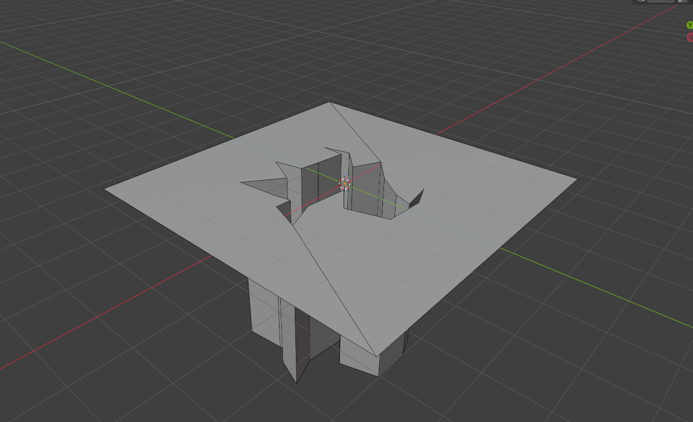
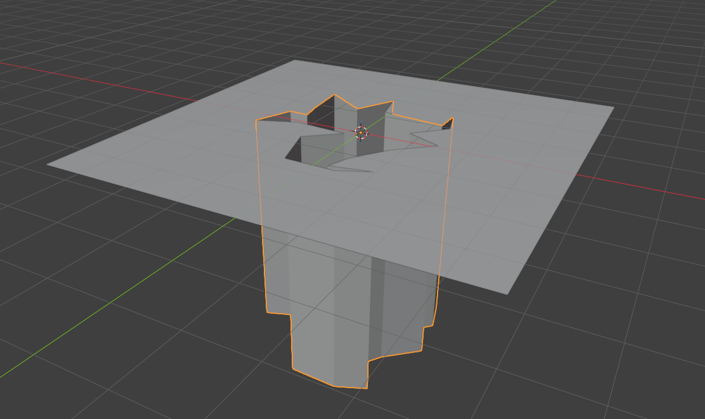
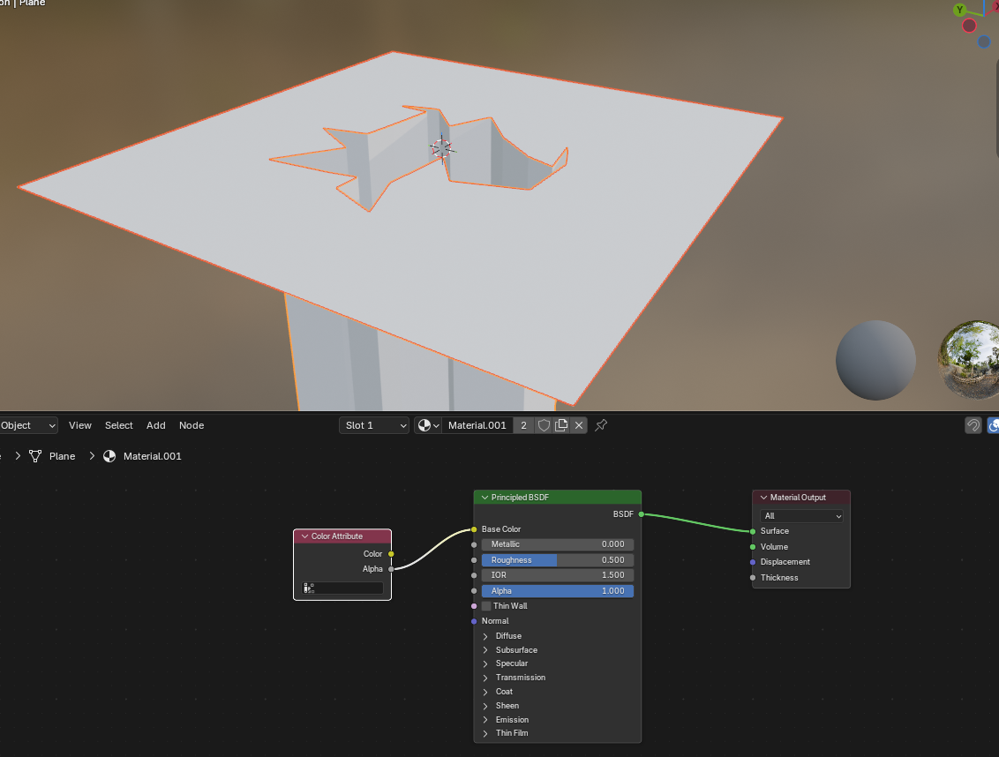
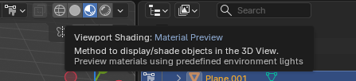
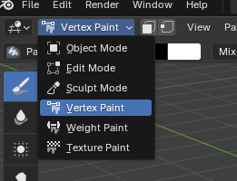
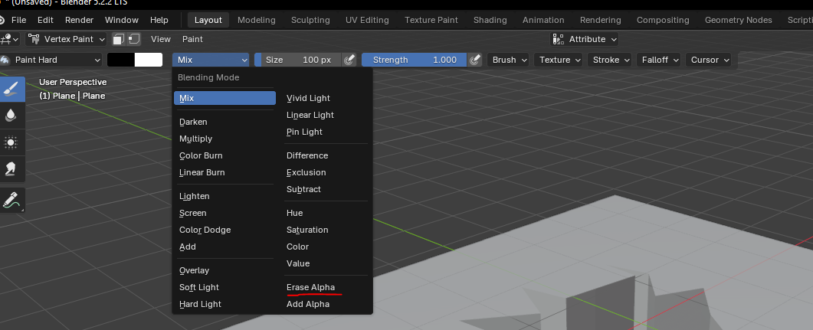
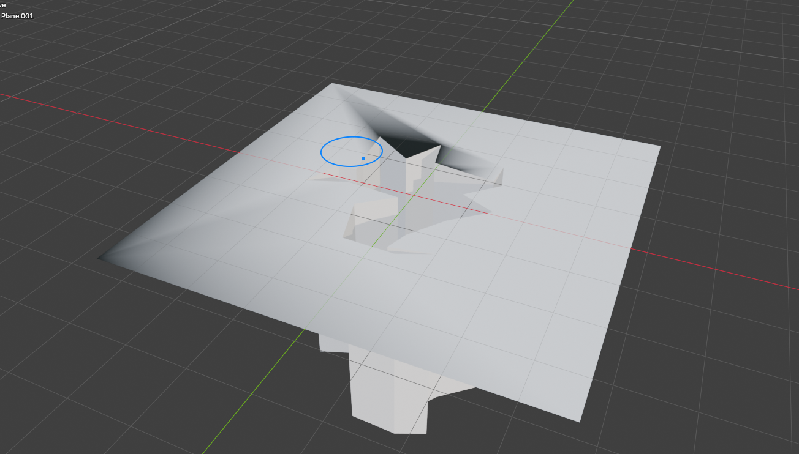
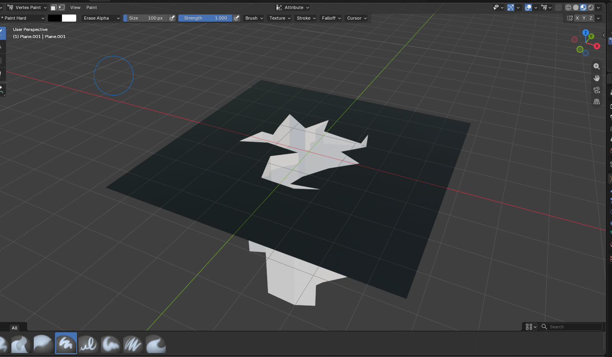

# ViewportStencil

Render models *inside* surfaces in Roblox: ground cracks, holes, craters, portals, windows into walls. Nothing is cut or
destroyed: a ViewportFrame on the surface shows the model as if you were looking through the surface into it, from any
camera angle.



## How it works

ViewportStencil combines two existing techniques:

- **[rbx-viewport-window](https://github.com/EgoMoose/rbx-viewport-window)** by EgoMoose: an off-axis projection that
  makes a ViewportFrame on a SurfaceGui line up with the world behind it, so it looks like a window instead of a flat
  image.
- **[ViewportFrame masking](https://devforum.roblox.com/t/viewportframe-masking/2964839)**: faces whose vertex alpha
  has been erased render invisible inside a ViewportFrame, but still hide whatever is behind them. The model carries its
  own mask: a flat plane around the opening with erased alpha. Through the mask you see the real ground, and the rest of
  the model only shows through the opening.

The mask is part of the mesh, so each model defines its own shape. See [Making a model](#making-a-model).

## Installation

**Wally**

```toml
[dependencies]
ViewportStencil = "aziorux/viewport-stencil@1.0.0"
```

**Manually**: download `ViewportStencil.rbxm` from the Releases page and put it in `ReplicatedStorage`.

**Just want to try it?** Download `ViewportStencil-Demo.rbxl` from the Releases page, open it in Studio and press Play.
See [Example](#example).

## Example

The [Releases page](../../releases) has a demo place, `ViewportStencil-Demo.rbxl`, ready to play: click anywhere
(floor or wall) to spawn a crack that disappears after 10 seconds.

What's in the demo:

- `ReplicatedStorage.ViewportStencil`: the module.
- `ReplicatedStorage.Assets.Crack.CrackTest`: the crack model from [`example/crack.blend`](example/crack.blend), set up as
  described in [Making a model](#making-a-model).
- `ReplicatedStorage.Assets.Crack.VFX`: particles and a purple light spawned with each crack. The light tints nearby
  stencils; see [Lighting](#lighting).
- `StarterPlayerScripts.Example`: the script that spawns the cracks, [`example/Example.client.lua`](example/Example.client.lua).

In this repo, `example/` has the demo script and the Blender file for the crack.

## Usage

ViewportStencil only runs on the client.

```lua
local ReplicatedStorage = game:GetService("ReplicatedStorage")
local ViewportStencil = require(ReplicatedStorage.ViewportStencil)

local crack = ReplicatedStorage.Crack -- a Model

-- A CFrame on whatever the mouse is pointing at, randomly rotated around the surface normal
local cframe = ViewportStencil.Utils.fromMouse(nil, nil, math.random() * 2 * math.pi)
if cframe then
	ViewportStencil.new(crack:Clone(), cframe, { lifetime = 10 })
end
```

The stencil takes ownership of the model (it's destroyed along with the stencil), so pass a clone.

Stencils work on any surface. The CFrame is a point on the surface, with its UpVector along the surface normal. The
`Utils` functions build it from a raycast, so walls and ceilings work the same as floors.

## API

### `ViewportStencil.new(model: Model, cframe: CFrame, options: StencilOptions?): Stencil`

Creates a stencil that renders `model` inside the surface at `cframe`.

| Option | Default | |
| --- | --- | --- |
| `size: Vector2` | 90% of the model's footprint | Surface size in studs, along the CFrame's X and Z axes. The model is clipped outside it. |
| `lifetime: number` | never | Seconds until the stencil destroys itself. |
| `destroyModel: boolean` | `true` | When `false`, the model is unparented instead of destroyed. |
| `transparency: number` | `0` | Transparency of the whole stencil. |
| `maxDistance: number` | `1000` | Hidden beyond this distance from the camera. |
| `brightness: number` | `1` | `SurfaceGui.Brightness` |
| `lightInfluence: number` | `1` | `SurfaceGui.LightInfluence` |
| `ambient: Color3` | white | `ViewportFrame.Ambient` |
| `lightColor: Color3` | `(140, 140, 140)` | `ViewportFrame.LightColor` |
| `lightDirection: Vector3` | `(-1, -1, -1)` | `ViewportFrame.LightDirection` |

### `Stencil`

| | |
| --- | --- |
| `stencil.model` | The model being rendered. Don't reparent it. |
| `stencil:setCFrame(cframe)` / `getCFrame()` | Moves the stencil. |
| `stencil:setSize(size: Vector2)` / `getSize()` | Resizes the surface. |
| `stencil:setTransparency(t)` / `getTransparency()` | Useful to fade it out before destroying it. |
| `stencil:destroy()` | Also `:Destroy()`, so it works with Maid, Janitor, Trove... Safe to call more than once. |
| `stencil:isDestroyed()` | |

### `ViewportStencil`

| | |
| --- | --- |
| `getActive(): { Stencil }` | Every stencil that hasn't been destroyed. |
| `destroyAll()` | |

### `ViewportStencil.Utils`

All of these return a CFrame ready for `new`, or `nil` if nothing was hit. `angle` (radians) spins the stencil around
the surface normal. `params` defaults to ignoring the local player's character.

| | |
| --- | --- |
| `fromMouse(params?, maxDistance?, angle?)` | Whatever is under the mouse. |
| `fromScreenPoint(x, y, params?, maxDistance?, angle?)` | Whatever is under a point in viewport coordinates. |
| `belowCharacter(character?, maxDistance?, angle?)` | The ground under a character (the local player's by default). |
| `raycast(origin, direction, params?, angle?)` | Whatever the ray hits. |
| `fromRaycastResult(result, angle?)` | |
| `fromNormal(position, normal, angle?)` | |

## Making a model

A model is a mesh with two parts: the **mask**, a flat plane on top with a hole in it, and the **visible part**, what
you see through the hole (the walls and bottom of a crack, for example). This walks through a ground crack in Blender;
the finished file is in [`example/crack.blend`](example/crack.blend). The
[DevForum post](https://devforum.roblox.com/t/viewportframe-masking/2964839) explains the masking and the erased-alpha
vertex paint in more detail.

### In Blender

**1.** Model the mesh: a flat plane with the opening cut out, and the geometry that goes below it.



**2.** Separate it into two parts: the mask (the plane) and the visible part (everything below). Vertex colors are
stored per vertex, so if they shared vertices, erasing the mask's alpha would also fade the edges of the visible part.



To see the erased alpha while painting, give the mesh a material with a **Color Attribute** node whose **Alpha** output
goes into the **Base Color** of the Principled BSDF, and switch the viewport shading to **Material Preview**.





**3.** Switch to **Vertex Paint** mode.



**4.** Set the brush's blending mode to **Erase Alpha**.



**5.** Paint over the whole mask plane. Any part you miss will be visible in game.



**6.** When you're done, the whole mask should look black with the material from step 2, and the visible part should
be untouched.



**7.** Export both objects together as one FBX (no need to join them in Blender), then import the FBX into Studio as a
single mesh, so both parts end up in one MeshPart.

### In Studio

Put the imported MeshPart in a `Model` and set it as the model's `PrimaryPart`:

```
Crack (Model, PrimaryPart = Crack)
└── Crack (MeshPart)
```

- The **top of the `PrimaryPart`** is placed flush with the surface, so the mask plane must be the highest point of the
  mesh. Without a `PrimaryPart`, the top of the model's bounding box is used.
- The model's **up** is its `PrimaryPart`'s UpVector (world up without a `PrimaryPart`), aligned with the surface normal.
- Keep the opening centered on the mesh: the surface is centered on the stencil's CFrame.
- By default the surface is 90% of the model's footprint. Leaving the mask's outer edges out of the surface hides a
  thin line of light that otherwise shows along them. If you pass your own `size`, keep it a bit smaller than the mask.
- Keep the mask tight around the opening. The viewport's pixels are spread over the whole surface, so a lot of empty
  mask around a small crack makes it blurrier.
- Anything else in the model (extra parts, effects) works as long as it stays below the mask.

## Lighting

A stencil is lit in two separate layers, and both change how the model looks:

1. **The ViewportFrame's own lighting.** Objects inside a ViewportFrame don't use `Lighting` or any lights in the
   world. They only get the ViewportFrame's `Ambient` light and one directional light (`LightColor` and
   `LightDirection`). This is where the model gets its shading.
2. **World lighting on the SurfaceGui.** Once the ViewportFrame's image is drawn on the surface, the SurfaceGui is lit
   by the world like any other surface, scaled by `LightInfluence`. With `lightInfluence = 1`, a colored light near the
   stencil tints it. With `0`, it ignores world lighting and shows the ViewportFrame's image as is.

`brightness` (`SurfaceGui.Brightness`) multiplies the final result. It's useful for glowing effects.

The defaults (white `ambient`, `lightInfluence = 1`) light the model evenly and let it pick up the world's lights. That
suits glowing, magical cracks, but a plain grey mesh will look flat and bright, and will take the color of any nearby
light.

Some starting points:

```lua
-- Realistic hole: dark inside, lit from above, ignores world lights
ViewportStencil.new(model, cframe, {
	ambient = Color3.fromRGB(60, 60, 60),
	lightColor = Color3.fromRGB(200, 200, 200),
	lightDirection = Vector3.new(0, -1, 0),
	lightInfluence = 0,
})

-- Glowing crack: fully lit and brighter than its surroundings
ViewportStencil.new(model, cframe, {
	ambient = Color3.new(1, 1, 1),
	lightInfluence = 0,
	brightness = 2,
})

-- Blends with the scene: shaded by the viewport, tinted by nearby lights
ViewportStencil.new(model, cframe, {
	ambient = Color3.fromRGB(120, 120, 120),
	lightInfluence = 1,
})
```

`lightDirection` is the direction the light travels, in world space: `(0, -1, 0)` shines straight down and lights
upward-facing surfaces. The default `(-1, -1, -1)` comes diagonally from above.

The model's own colors, materials and textures still apply inside the ViewportFrame, with some limits: ViewportFrames
don't render shadows or post-processing, and Neon and Glass render at the lowest quality, so Neon shows as a flat,
bright color that doesn't glow or light up anything around it.

## Performance

- Only stencils that are on screen, within `maxDistance` and in front of their surface are rendered. The rest have
  their SurfaceGui disabled and skip their per-frame update.
- When the camera doesn't move, nothing is updated.
- The real cost is the GPU rendering each visible ViewportFrame, so keep the number of stencils on screen reasonable
  and the meshes simple.

## Limitations

- Client only.
- ViewportFrames have no anti-aliasing, so edges are slightly jagged.
- The surface is a rectangle; the mask on the model is what gives it its shape.
- Overlapping stencils don't merge: the one on top covers the other.

## Development

```sh
rojo serve dev.project.json
```

`dev.project.json` syncs the library into `ReplicatedStorage.ViewportStencil` and the example from `example/` into
`StarterPlayerScripts`. `default.project.json` is just the library, used for Wally and `rojo build`.

## Credits

- [EgoMoose](https://github.com/EgoMoose) for [rbx-viewport-window](https://github.com/EgoMoose/rbx-viewport-window).
- [ViewportFrame masking](https://devforum.roblox.com/t/viewportframe-masking/2964839) on the DevForum.

## License

[MIT](LICENSE)
